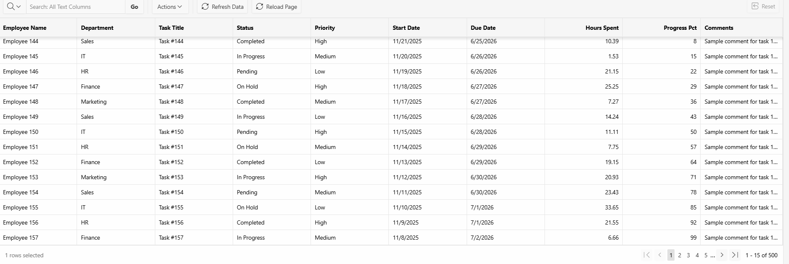

# Interactive Grid Persistence (IGPersist)

Automatically restore the current page of an Oracle APEX Interactive Grid after refresh or reload.

---

## ✨ Features

- Restore grid page after refresh or reload
- Works with Oracle APEX Interactive Grid
- Supports lazy-loaded pagination
- No server-side code required
- Fully client-side using localStorage

---

## ⚠️ Requirement

Interactive Grid must have:
• Lazy Loading = Enabled  
• Pagination Type = Page  
• Show Total Row Count = Enabled

---

## 🚀 Installation

1. Import the plugin into your APEX application
2. Create a Dynamic Action:
   - Event: **Page Load**
   - Action: **Interactive Grid Persistence**
3. Select your Interactive Grid region
4. Choose a mode (see below)

---

## ⚙️ Configuration

### Available Modes

| Mode        | Description |
|------------|------------|
| ON_LOAD    | Restore page on initial load |
| ON_REFRESH | Restore page after refresh |
| BOTH       | Combine both behaviors |

---

## 🧠 How It Works

The plugin stores the current grid page in the browser’s **localStorage**.

When the grid reloads:
- It detects the stored page
- Waits for pagination to be ready
- Navigates automatically to the saved page

---

## 📸 Demo

👉 [Live Demo](https://medezzinmh.com/sites/r/byteapex/apex-dev-hub/ig-persist)

---

## 🐛 Issues & Support

Use GitHub Issues:
👉 https://github.com/medezzinmh/ig-persist/issues

---

## 📄 License

MIT License

---

## 👤 Author

**Mahmoudi Mohamed Ezzin**  
Oracle APEX Developer